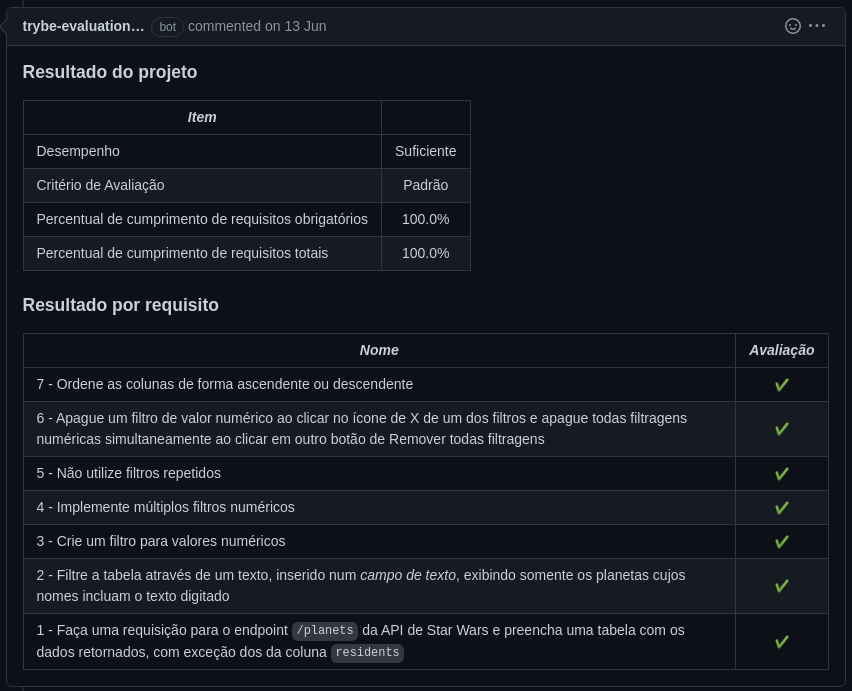
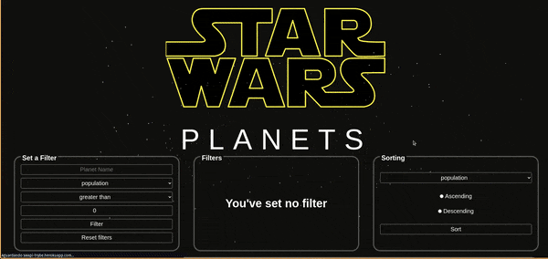

# Português 🇧🇷🇵🇹

<details>
  <summary>
    Saiba mais
  </summary>
  
  # Star Wars Planets
Projeto da Trybe - Bloco 17 - Aplicação de jogo de busca de planetas do Star Wars feita com React, utilizando Context API e React Hooks.

## 💻 Projeto

Aplicação que lista e filtra os planetas do universo de Star Wars usando Context API e Hooks para controlar os estados globais.

<details>
  <summary><strong>🏆 Meu desempenho</strong></summary><br />

  
  
</details>


## 🚀 Tecnologias
> Este projeto foi desenvolvido com:

- JavaScript
- React
- Context API
- React Hooks
- SCSS/SASS
- Styled Components

## 📌 Habilidades
> Habilidades desenvolvidas:

- Utilizar a Context API do React para gerenciar estado;
- Utilizar os React Hooks useContext, useState e useEffect;
- Criar React Hooks customizados;
- Estilizar componentes React utilizando SCSS/SASS e Styled Components.

## ⬇️ Instalando dependências

```bash
npm install
``` 

## ⚡ Executando o projeto

```
npm start
```

## Time de desenvolvimento
> Projeto individual:
  

## 💬 Contatos

<div align="center" style="display: inline_block">
  <a href="https://rabeloguedes.github.io" target="_blank">
    
  </a> 
  <a href="https://www.linkedin.com/in/al%C3%AA-emmanuel-rabelo-guedes/" target="_blank">
    
  </a> 
   <a href="mailto:rabeloguedes@proton.me">
     
  </a>
</div>

</details>

# English 🇺🇸🇬🇧

<details>
  <summary>
    More
  </summary>
  
  # Star Wars Planets
Trybe Project - Block 17 - Star Wars Planets game application made with React, using Context API and React Hooks.

## 💻 Project

Application that lists and filters the planets of the Star Wars universe using Context API and Hooks to control global states.

<details>
  <summary><strong>🏆 My accomplishment</strong></summary><br />

  
  
</details>


## 🚀 Technologies
> This project was developed with:

- JavaScript
- React
- Context API
- React Hooks
- SCSS/SASS
- Styled Components

## 📌 Skills
> Practiced skills:

- Use the React Context API to manage state;
- Use the React Hooks useContext, useState and useEffect;
- Create custom React Hooks;
- Style React components using SCSS/SASS and Styled Components.

 ## ⬇️ Install dependencies

```bash
npm install
``` 

## ⚡ Running the project

```
npm start
```

## Squad
> Single Person Project:
  

## 💬 Contact

<div align="center" style="display: inline_block">
  <a href="https://rabeloguedes.github.io" target="_blank">
    
  </a> 
  <a href="https://www.linkedin.com/in/al%C3%AA-emmanuel-rabelo-guedes/" target="_blank">
    
  </a> 
   <a href="mailto:rabeloguedes@proton.me">
     
  </a>
</div>

</details>

# Deutsch 🇩🇪

<details>
  <summary>
    Mehr
  </summary>
  
  # Star Wars Planets
Trybe Projekt - Block 17 - Star Wars Planets Spielanwendung erstellt mit React, Context API und React Hooks.

## 💻 Projekt

Anwendung, die die Planeten des Star Wars-Universums auflistet und filtert, indem Context API und Hooks verwendet werden, um globale Zustände zu steuern.

<details>
  <summary><strong>🏆 Meine Leistung</strong></summary><br />

  
  
</details>

## 🚀 Technologies
> Dieses Projekt wurde mit den entsprechenden Technologies hergestellt:

- JavaScript
- React
- Context API
- React Hooks
- SCSS/SASS
- Styled Components

## 📌 Fähigkeiten
> Ausgeübte Fähigkeiten:

- Verwenden Sie die React Context API zum Verwalten des Status;
- Verwenden Sie die React Hooks useContext, useState und useEffect;
- Erstellen Sie benutzerdefinierte React Hooks;
- Stilisieren Sie React-Komponenten mit SCSS/SASS und Styled Components.

## ⬇️ Installieren dependencies

```bash
npm install
``` 

## ⚡ Projekt ausführen

```
npm start
```

## Entwickungsteam
> Einer Person Projekt:
  

## 💬 Kontakt

<div align="center" style="display: inline_block">
  <a href="https://rabeloguedes.github.io" target="_blank">
    
  </a> 
  <a href="https://www.linkedin.com/in/al%C3%AA-emmanuel-rabelo-guedes/" target="_blank">
    
  </a> 
   <a href="mailto:rabeloguedes@proton.me">
     
  </a>
</div>

</details>
